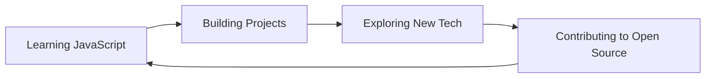

<div align="center">
  
</div>

<h1 align="center">
  
</h1>

<p align="center">
  
  
</p>

## 🚀 About Me

> **Full Stack Developer** with 2+ years of experience crafting efficient and scalable web applications. I specialize in **React.js**, **Next.js**, **Node.js**, **Express.js**, and **Laravel**, constantly pushing the boundaries of modern web development.

```javascript
const zabir = {
    location: "Dhaka, Bangladesh",
    role: "Full Stack Developer",
    company: "Limerick Resources Limited",
    code: ["JavaScript", "PHP", "HTML", "CSS"],
    technologies: {
        frontend: ["React.js", "Next.js", "jQuery", "Bootstrap", "Tailwind CSS", "Material UI"],
        backend: ["Node.js", "Express.js", "Laravel", "REST API", "PHP OOP"],
        tools: ["cPanel", "WordPress", "Git"],
    },
    currentFocus: "Mastering JavaScript & Building Scalable Applications",
    challenge: "Always seeking new opportunities to innovate",
};
```

## 💻 Tech Stack

<div align="center">

### Frontend


### Backend


### Tools & Others


</div>

## 🎯 Current Focus



- 🔭 Working at **Limerick Resources Limited**
- 🌱 Deep diving into **JavaScript** mastery
- 💡 Building innovative web solutions
- 🤝 Open to collaboration on exciting projects

## 📊 GitHub Analytics

<div align="center">
  
  
</div>

<div align="center">
  
</div>

<div align="center">
  
</div>

## 📈 Contribution Graph

<div align="center">
  
</div>

## 🌐 Connect With Me

<div align="center">
  
[](https://www.linkedin.com/in/zabiremu/)
[](https://github.com/zabiremu)
[](https://www.facebook.com/zabiremu)
[](https://www.instagram.com/zabiremu/)
[](https://zabiremu.netlify.app/)

📧 **Email:** zabirraihan570@gmail.com

</div>

## 🎖️ GitHub Badges

<div align="center">
  <a href='https://archiveprogram.github.com/'>
    
  </a>
  <a href='https://docs.github.com/en/developers'>
    
  </a>
  <a href='https://github.com/pricing'>
    
  </a>
  <a href='https://stars.github.com/'>
    
  </a>
  <a href='https://docs.github.com/en/github/supporting-the-open-source-community-with-github-sponsors'>
    
  </a>
</div>

---

<div align="center">
  
  
  **💬 "Code is like humor. When you have to explain it, it's bad." – Cory House**
  
  <sub>⭐️ From [zabiremu](https://github.com/zabiremu) | Let's build something amazing together!</sub>
</div>
