<div align="center">
  
</div>

<div align="center">
  
</div>

<div align="center">
  
  
  
</div>

<br>


### 👨‍💻 About Me

```typescript
const zabir = {
    name: "Zabir Raihan Emu",
    role: "Full Stack Developer 💼",
    location: "Dhaka, Bangladesh 🇧🇩",
    company: "Limerick Resources Limited",
    
    code: ["JavaScript", "TypeScript", "PHP", "HTML", "CSS"],
    
    technologies: {
        frontend: {
            js: ["React.js", "Next.js", "jQuery"],
            css: ["Tailwind", "Bootstrap", "Material UI"],
        },
        backend: {
            js: ["Node.js", "Express.js", "REST API"],
            php: ["Laravel", "PHP OOP", "WordPress"],
        },
        tools: ["Git", "cPanel", "Postman", "VS Code"],
        databases: ["MySQL", "MongoDB"],
    },
    
    currentFocus: "Mastering Modern JavaScript Ecosystem",
    lifePhilosophy: "Code, Learn, Repeat 🔄",
};
```

<br clear="right"/>

## 🛠️ My Tech Arsenal

<div align="center">

<table>
<tr>
<td align="center" width="50%">

### 🎨 Frontend Development


</td>
<td align="center" width="50%">

### ⚙️ Backend Development


</td>
</tr>
<tr>
<td align="center" width="50%">

### 🗄️ Databases & Tools


</td>
<td align="center" width="50%">

### 🚀 Currently Exploring


</td>
</tr>
</table>

</div>

## 🎯 What I'm Up To

```mermaid
%%{init: {'theme':'dark'}}%%
mindmap
  root((Zabir's<br/>Journey))
    🔭 Working
      Limerick Resources Limited
      Building Scalable Apps
    🌱 Learning
      Advanced JavaScript
      Cloud Technologies
      System Design
    💡 Creating
      Open Source Projects
      Innovative Solutions
    🤝 Collaborating
      Tech Communities
      Exciting Projects
```

<div align="center">



</div>

<br>

<div align="center">

### 💼 Professional Focus

| 🔭 Currently Working | 🌱 Learning | 💬 Ask Me About | 📫 Reach Me |
|:---:|:---:|:---:|:---:|
| **Limerick Resources Ltd** | **JavaScript Mastery** | **React, Laravel, APIs** | **zabirraihan570@gmail.com** |

</div>

## 📊 GitHub Analytics

<div align="center">
  
  
</div>

<div align="center">
  
  
</div>

<div align="center">
  
</div>

## 🎨 Contribution Snake

<div align="center">
  <picture>
    <source media="(prefers-color-scheme: dark)" srcset="https://raw.githubusercontent.com/zabiremu/zabiremu/output/github-contribution-grid-snake-dark.svg">
    <source media="(prefers-color-scheme: light)" srcset="https://raw.githubusercontent.com/zabiremu/zabiremu/output/github-contribution-grid-snake.svg">
    
  </picture>
</div>

## 🌐 Let's Connect

<div align="center">
  <a href="https://www.linkedin.com/in/zabiremu/">
    
  </a>
  <a href="https://github.com/zabiremu">
    
  </a>
  <a href="https://www.facebook.com/zabiremu">
    
  </a>
  <a href="https://www.instagram.com/zabiremu/">
    
  </a>
  <a href="https://zabiremu.netlify.app/">
    
  </a>
  <a href="mailto:zabirraihan570@gmail.com">
    
  </a>
</div>

<br>

<div align="center">

### 🎖️ GitHub Achievements

<a href='https://archiveprogram.github.com/'>
  
</a>
<a href='https://docs.github.com/en/developers'>
  
</a>
<a href='https://github.com/pricing'>
  
</a>
<a href='https://stars.github.com/'>
  
</a>
<a href='https://docs.github.com/en/github/supporting-the-open-source-community-with-github-sponsors'>
  
</a>

</div>

## 💭 Dev Quote

<div align="center">
  
</div>

<br>

## 🎵 Spotify Playing

<div align="center">
  
</div>

---

<div align="center">
  
  
  <h3>
    
  </h3>
  
  <p>
    
    
  </p>
  
  <sub>⭐️ From <a href="https://github.com/zabiremu">zabiremu</a> | Let's build something amazing together! 🚀</sub>
</div>
